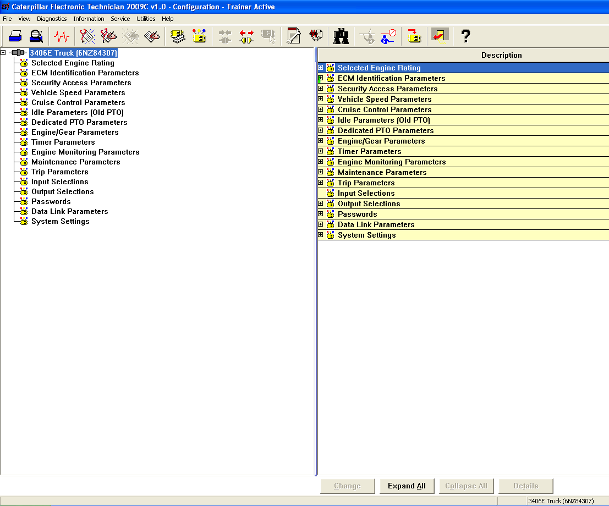
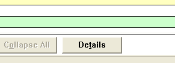

# CAT ET caterpillar ECM programming Guide

#### Sections
1. Gather Engine Info
2. Select correct ECM partnumber
3. Select correct flash file number
4. Connect and Flash ECM
5. Modify Features and Parameters
6. Create work orders

## Section 1 Gather Engine Info
**Gather Information from**
  - ECM order form (yellow slip)
  - work orders of original
    - if original ECM was communicating when received a
       workorder will exist using filename format customerName(INITIAL/FINAL) MM-D-YY
       ex: Texas Diesel (INTIAL) 1-21-22.pdf
    - ecm replacement file will also exist with same format but with .xls file type
       ex: Texas Diesel (INTIAL) 1-21-22.xls   

**Required Information if no work orders** see below for details
1. Engine serial number
2. Vin Number
3. Horsepower and Torque desired
4. Vehicle speed limit desired
5. Engine brakes installed on vehicle?
6. A/C pressure Switch

##### Required info Detailed
1. Engine Serial Number
   - ex: 6NZ12345 will always be a 3 digit alpha numeric (6NZ) folowed by 5 numbers (12345)
2. VIN number to verify if on a GM chasis
3. Horse Power
    - if none specified you may choose any available for engine serial number or if you nice max rating
4. Vehicle speed limit
    - some customers will say kilometers per hour
      if they specify anything over 100 they most likely mean KPH especially from canada
      most units will not accept over 100 MPH verify with customer
5. Enginge Brakes installed ?
    - Also known as Jake Brakes
    - Depending on application and terrain
    some settings for engine brakes will be more desirable especially in mountainous terrain
6. Air conditioning pressure switch controls fan ?
    -some A/C systems require engine radiator fan to activate in order to regulate pump pressure for A/C
     if not set up correctly fan will stay on all the time or A/C will not function for extended periods

## Section 2 Select Correct ECM Partnumber
  - Board type
    - KM KA - C16, C15, C12, C10, 3406
      - Compatible with
      - 6NZ
      - 7CZ
      - 2WS
      - 2KS
      - 3CS
      - 1MM

    - IE - C7
      - Compatible with
      - KAL
      - WAX
      - FML
      - FMM
      - SAP

    - JJ - C15, C13 twin turbo
      - Compatible with
      - BXS
      - KCB
      - KCA

    - KC - 3126
      - Compatible with
      - 8YL
      - 7AS
      - CKM
      - HEP
      - 9SZ
      - LEF

    - FV FW - 3126
      - Compatible with
      - 7AS
        - FV for **NON** GM chasis
        - FW **ONLY** for GM Chasis
      - 8YL
        - FV for **NON** GM chasis
        - FW **ONLY** for GM Chasis

    - IC - 3126
      - Compatible with
      - 8YL
      - 7AS
      - CKM
      - HEP
      - 9SZ
      - LEF

    - IH - C15, C12, C10, 3406, 3126 
      - Compatible with
      - 6NZ
      - 7CZ
      - MBN
      - MBL
      - HEP
      - 8YL
      - 7AS
      - CKM
      - 9SZ
      - LEF

    - IK - C15, C12, C10, 3406, 3126 
      - Compatible with
      - 6NZ
      - 7CZ
      - MBN
      - MBL
      - HEP
      - 8YL
      - 7AS
      - CKM
      - 9SZ
      - LEF

## Sectino 3 Select correct flash file number
  - Open flash-file-list.pdf on desktop
  - using engine serial first 3 digits ex: 6nz from **6nz**12345 press control + f
    to bring up find tool and type in the **first 3 digits of serial numbers**

  - once you find the section for your serial make sure the files you Select
    is compatible with your serial number by paying attention to **serial number range**
    below both flash files are for a 6NZ engine but only one of them is compatible with
    the serial range **6NZ12345**
    
    
    

## Section 4 Connect and Flash ECM
  - click on CAT ET desktop application
      - 
  - Cat ET menu
      - 
  - click connect button
      - 
  - click Winflash buttion
      - 
  - load flash file you selected from section 3 using browse button
      - 
  - click flash button at bottom right of screen
      - 
  - when finished click back to CAT ET
      - 

## Section 5 Modify Features and Parameters
  - after flash you must add missing truck parameters when you flash you program the engine specifications
    but depending on the application the engine can go into multiple trucks so you have to modify the features
    to fit the truck

  - click on features and parameters buttion

  - when screen loads you will see something similar to this
    - 

  - click on expand all at bottom of screen and all options will become visible
    - 

  - after the expand you will see all available options and modify according to customer specifications
    simply double click on the option you want to change
    
    - 
  
  - the most important settings that **MUST BE CONFIGURED** or engine will not run past idle 
    - the engine serial must be programmed or it will cause engine to log a fault code and will turn on the check engine light
      - 

    - the personality module code must be programmed or engine will not function past idle rpm causing vehicle to have no throttle response and also log a fault code
      - 
    - if you are unsure on what any option does or how to configure you can always select and option and click on details at the bottom of the page
      - 
    - the details button will open a manual detailing how to modify and a description of the feature
      - 

# **Password protected parameters IMPORTANT**

  - ## **some features will have keys next to them and will require passwords so be carefull when changing theses options without having a way to get the passwords**
  - NOTICE THE KEYS next to the engine serial number parameter
      - 
  - when attempting to change parameter you will be prompted for a password after you confirm the change
    - 
    - 

## Section 6 Create Workorders
